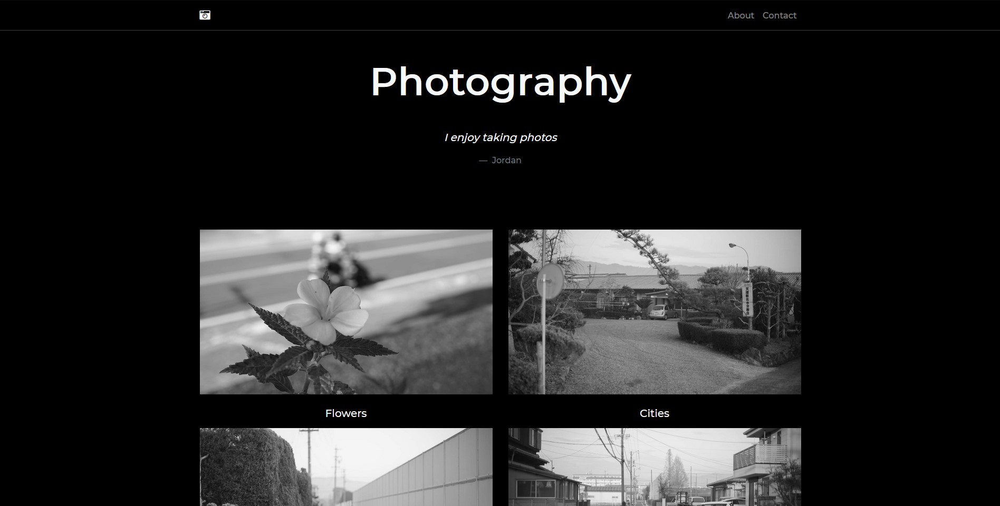
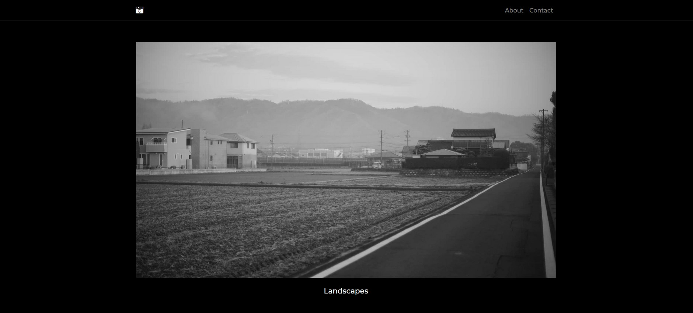
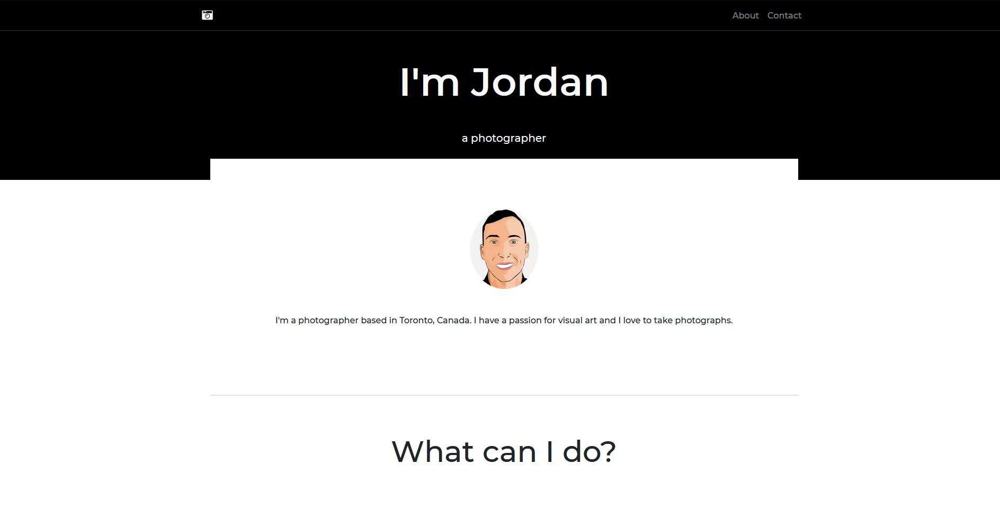

# Photography Portfolio Site

Simple grid style portfolio site for photographers

|   |   |
|---|---|


## Introduction 

I created this site as a way to learn Bootstrap and how to layout a static portfolio site. 

### Features

* Grid Style Layout
* Image Light Box
* Responsive Design

|   |   |
|---|---|

### Technologies

* Bootstrap 4.5.0
* Webpack 5.0.0-beta.22
* JavaScript 
* jQuery
* Font Awesome Icons 5.14.0

### Installation 

This app requires [Node.js](https://node.js.org/) v14.4.0 to run

Install the dependecies

```sh
$ npm install
```

Start the dev server

```sh
$ cd photography-portfolio-site
$ npm run serve
```

For production build

```sh
npm run build
```

### Sources 

This site was largerly inspired by the Milo - Magazine/Blog Theme by the Bootlab team. [@Bootlab](https://themes.getbootstrap.com/store/bootlab/)